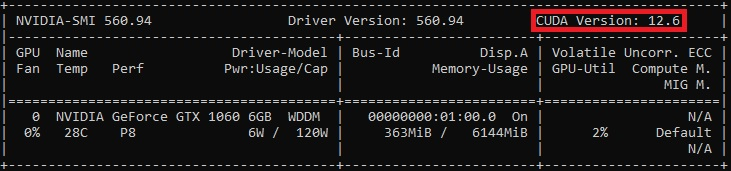

# IBS Behavior Analysis Program (IBS-BAP)
This program is under construction

## Functions
Visualize mp4 file and make bounding boxes.

Run Yolo11 for pose estimation (You can use your own model weight).
* Run by CPU in default, but if you install **CUDA** appropriately, you can utilize GPU as well.
To check your cuda version, run powershell or other prompt and run this command:
```bash
nvidia-smi
```
You can see this kind of image:



Save all the images and bounding boxes (format: class_id, center_x, center_y, width, height).

## Installation
**Anaconda environment** is recommanded.
Make and activate a virtual environment with python 3.10.
```bash
conda create -n IBS_BAP python=3.10
conda activate IBS_BAP
```
Then, copy this repository to your computer.
```bash
git clone https://github.com/spkim8804/IBS_BAP.git
cd IBS_BAP
```
Install libraries.
```bash
pip install -r requirements.txt
```
